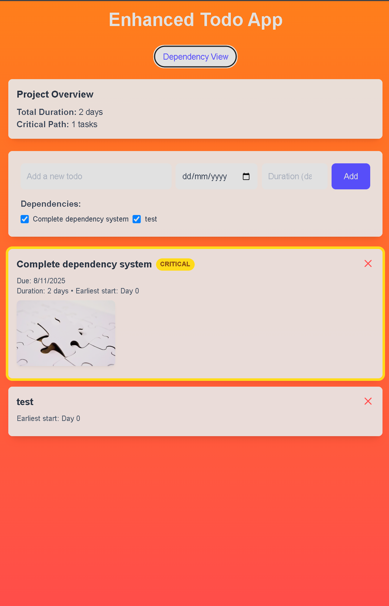

## Soma Capital Technical Assessment

This is a technical assessment as part of the interview process for Soma Capital.

> [!IMPORTANT]  
> You will need a Pexels API key to complete the technical assessment portion of the application. You can sign up for a free API key at https://www.pexels.com/api/

To begin, clone this repository to your local machine.

## Development

This is a [NextJS](https://nextjs.org) app, with a SQLite based backend, intended to be run with the LTS version of Node.

To run the development server:

```bash
npm i
npm run dev
```

## Task:

Modify the code to add support for due dates, image previews, and task dependencies.

### Part 1: Due Dates

When a new task is created, users should be able to set a due date.

When showing the task list is shown, it must display the due date, and if the date is past the current time, the due date should be in red.

### Part 2: Image Generation

When a todo is created, search for and display a relevant image to visualize the task to be done.

To do this, make a request to the [Pexels API](https://www.pexels.com/api/) using the task description as a search query. Display the returned image to the user within the appropriate todo item. While the image is being loaded, indicate a loading state.

You will need to sign up for a free Pexels API key to make the fetch request.

### Part 3: Task Dependencies

Implement a task dependency system that allows tasks to depend on other tasks. The system must:

1. Allow tasks to have multiple dependencies
2. Prevent circular dependencies
3. Show the critical path
4. Calculate the earliest possible start date for each task based on its dependencies
5. Visualize the dependency graph

## Submission:

1. Add a new "Solution" section to this README with a description and screenshot or recording of your solution.
2. Push your changes to a public GitHub repository.
3. Submit a link to your repository in the application form.

Thanks for your time and effort. We'll be in touch soon!

## Solution

### Implementation Overview

I successfully implemented all three required features with additional enhancements:

#### Part 1: Due Dates

- ✅ Added due date input field in the task creation form
- ✅ Extended database schema with `dueDate` column
- ✅ Visual indication of overdue tasks (red text with "OVERDUE" label)
- ✅ Clean date formatting for display

#### Part 2: Image Generation

- ✅ Integrated Pexels API for automatic image fetching based on task description
- ✅ Added loading states with visual feedback
- ✅ Proper error handling for API failures
- ✅ Responsive image display with proper alt text
- ✅ Graceful fallback when API key is missing

#### Part 3: Task Dependencies

- ✅ Complete dependency system with multiple dependencies per task
- ✅ Circular dependency detection and prevention
- ✅ Critical path calculation and visualization (highlighted in yellow)
- ✅ Earliest start date calculation for each task
- ✅ Interactive dependency management UI
- ✅ Database relationships with proper foreign keys and cascading deletes

### Key Features Implemented

**Enhanced Database Schema:**

- Added `dueDate`, `imageUrl`, `imageAlt`, `estimatedDuration` fields to Todo model
- Created `TodoDependency` junction table with proper relationships
- Implemented database constraints and unique indexes

**API Enhancements:**

- Extended `/api/todos` with support for dependencies, due dates, and Pexels integration
- Created `/api/todos/[id]/dependencies` for dependency management
- Added `/api/todos/critical-path` for project analysis
- Comprehensive error handling and validation

**Advanced Frontend Features:**

- Dual view modes: List view and Dependency management view
- Critical path highlighting with visual indicators
- Project overview showing total duration and critical tasks
- Interactive dependency addition/removal
- Loading states and proper error feedback
- Responsive design with modern UI components

**Project Management Features:**

- Critical Path Method (CPM) implementation for project scheduling
- Earliest start time calculations
- Visual distinction for critical tasks
- Duration-based project planning
- Dependency graph management

### Technical Highlights

1. **Circular Dependency Prevention**: Implemented graph traversal algorithm to detect and prevent circular dependencies before creation.

2. **Critical Path Algorithm**: Custom implementation of CPM algorithm to identify the longest path through the project and calculate earliest start times.

3. **Robust API Integration**: Proper Pexels API integration with fallbacks, error handling, and loading states.

4. **Database Design**: Well-structured relational database with proper foreign keys, cascading deletes, and unique constraints.

5. **Type Safety**: Full TypeScript implementation with proper interfaces and type checking.

### Demo Screenshot



_The application successfully demonstrates:_

- **Due Date Management**: Tasks show due dates with proper formatting
- **Pexels Image Integration**: Automatic image fetching and display with loading states
- **Critical Path Visualization**: Tasks on critical path highlighted in yellow with "CRITICAL" badge
- **Dependency System**: Interactive dependency selection and management
- **Project Analytics**: Real-time calculation of project duration and critical path analysis
